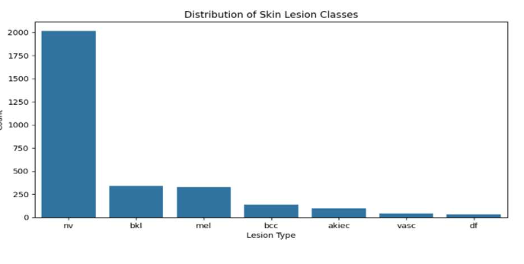
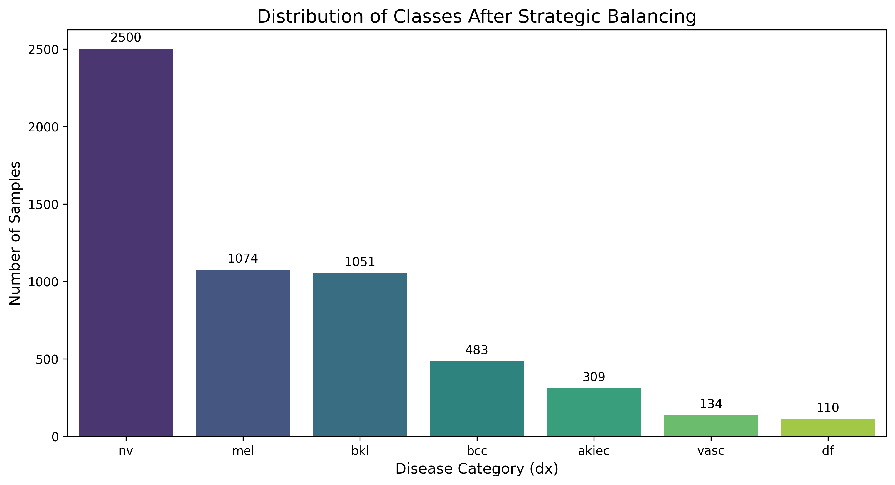
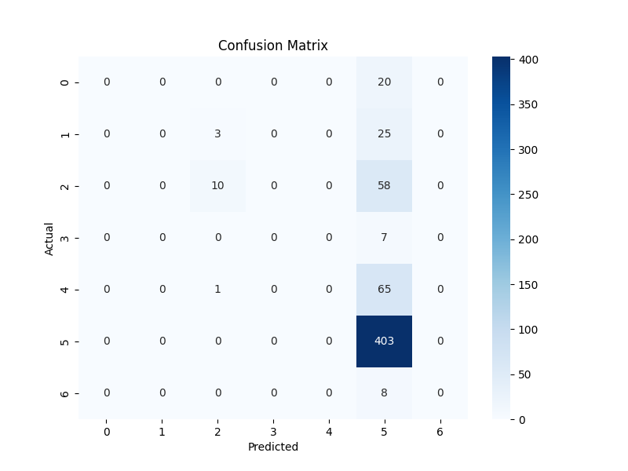
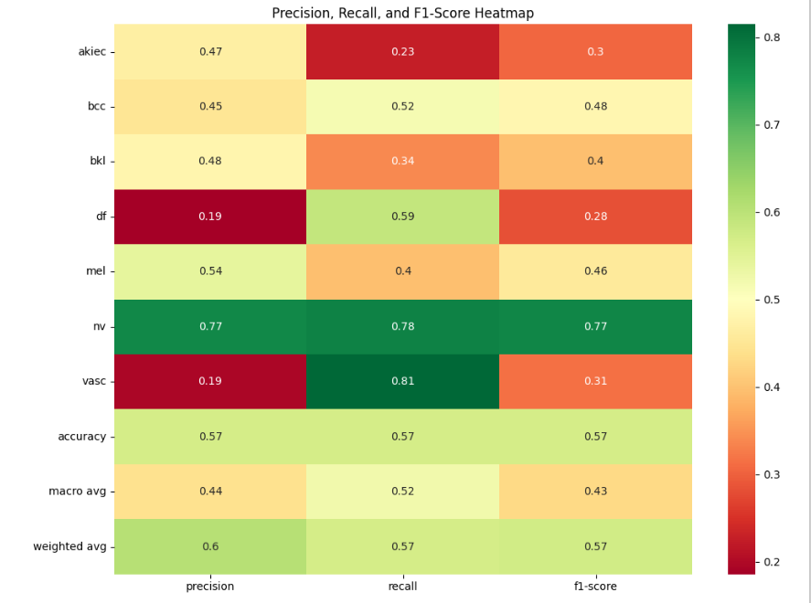

# Skin Lesion Classification Using Advanced Deep Learning

## Overview

Skin cancer is one of the most common and potentially life-threatening diseases worldwide. Early detection plays a crucial role in improving patient survival rates.

This project presents an advanced deep learning pipeline for automatic classification of dermatoscopic images using the HAM10000 dataset. The focus of this work is not only on model accuracy but also on handling class imbalance, improving model design, and applying rigorous evaluation techniques suitable for medical applications.

---

## Problem Statement

The objective of this project is to classify dermatoscopic images into seven diagnostic categories using deep learning. This is a multi-class classification problem with significant class imbalance, where certain classes dominate the dataset and bias model predictions.

---

## Dataset: HAM10000

- Total Images: 10,015  
- Number of Classes: 7  
- Domain: Medical Imaging  

### Classes:

- Melanoma (mel)  
- Melanocytic nevi (nv)  
- Basal cell carcinoma (bcc)  
- Actinic keratoses (akiec)  
- Benign keratosis (bkl)  
- Dermatofibroma (df)  
- Vascular lesions (vasc)  

### Key Challenge

The dataset is highly imbalanced, with the *melanocytic nevi (nv)* class dominating more than 65% of the samples. This imbalance can lead to biased learning and poor performance on minority classes.

---

## Dataset Links

- Research Paper: https://arxiv.org/abs/1803.10417  
- Kaggle Dataset: https://www.kaggle.com/datasets/kmader/skin-cancer-mnist-ham10000  

---

## Methodology

### Handling Class Imbalance

#### Original Distribution (Before Balancing)

#### Distribution After Strategic Balancing

The original dataset is highly skewed toward the *nv* class. To address this issue, strategic undersampling was applied to reduce the dominance of the majority class while preserving all minority classes. This ensures that the model learns meaningful features across all categories instead of focusing only on the dominant class.

---

### Model Approach

To improve performance beyond a basic CNN, a transfer learning approach was adopted:

- **MobileNetV2** pre-trained on ImageNet used as feature extractor  
- **Global Average Pooling** for dimensionality reduction  
- **Dense + Dropout layers** for classification  
- **Softmax output layer** for multi-class prediction  

---

### Training Strategy

A two-phase training approach was implemented:

1. **Feature Extraction Phase**
   - Base model frozen  
   - Learning rate = 1e-3  

2. **Fine-Tuning Phase**
   - Base model unfrozen  
   - Learning rate = 1e-5  
   - EarlyStopping applied to prevent overfitting  

Additional techniques:

- Class weighting to handle imbalance  
- Data augmentation (rotation, flipping, shifting)  
- Learning rate scheduling  

This controlled training setup ensures stable learning and better generalization.

---

## Results

### Confusion Matrix

### Classification Metrics (Precision, Recall, F1-score)

---

## Performance

| Metric            | Value |
|------------------|------|
| Accuracy         | ~57% |
| Macro Recall     | ~0.52 |
| Macro F1-score   | ~0.43 |

---

## Key Observations

- The model successfully predicts **all classes** (no majority class collapse)
- High recall achieved for minority classes:
  - vasc: 0.81  
  - df: 0.59  
- Balanced performance across all categories  
- Accuracy is lower than baseline but **more meaningful and reliable**

---

## Key Insights

- Accuracy alone is misleading for imbalanced datasets  
- Macro-F1 and recall provide a more realistic evaluation  
- Transfer learning significantly improves feature extraction  
- Proper handling of imbalance is critical in medical applications  

---

## Project Structure

skin-lesion-classification/
│
├── notebook.ipynb
├── report.pdf
├── README.md
├── figures/
│ ├── original_distribution.png
│ ├── balanced_distribution.png
│ ├── confusion_matrix.png
│ └── classification_metrics.png

---

## Future Work

- Apply focal loss for improved imbalance handling  
- Explore EfficientNet for better feature representation  
- Optimize classification thresholds for critical classes  
- Perform cross-validation for robust evaluation  

---

## Author

Mohsin
