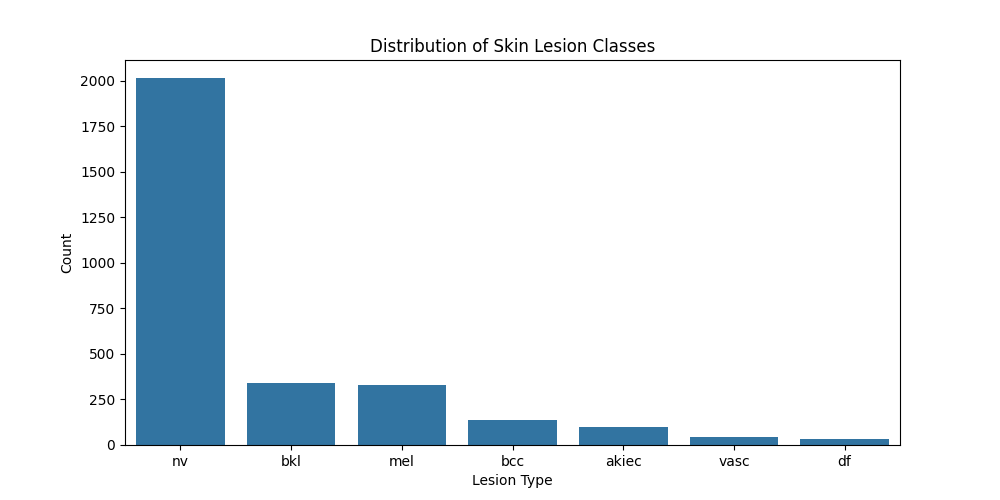

#  Skin Cancer Classification using Deep Learning (CNN)

##  Overview

Skin cancer is one of the most critical health challenges worldwide, where early diagnosis significantly increases survival rates. This project presents a deep learning-based approach for automatic classification of skin lesion images using a Convolutional Neural Network (CNN).

The model is trained on the HAM10000 dataset and demonstrates how deep learning can be applied to real-world medical image analysis.

---

##  Problem Statement

Manual diagnosis of skin cancer is time-consuming and requires expert dermatological knowledge. The objective of this project is to develop an automated system capable of classifying skin lesion images into multiple categories using deep learning techniques.

---

##  Dataset

The dataset used is **HAM10000 (Human Against Machine with 10000 training images)**, a benchmark dataset for skin lesion analysis.

* Number of classes: 7
* Total dataset size: ~10,000 images
* Used subset: 3000 images (for efficient training)
* Image type: Dermatoscopic images

 **Key Challenge:**
The dataset is highly imbalanced, with some classes having significantly more samples than others. This imbalance affects model performance.

---

##  Tech Stack

* Python
* TensorFlow / Keras
* NumPy & Pandas
* Matplotlib & Seaborn
* Scikit-learn

---

##  Project Workflow

### 1. Data Preprocessing

* Loaded metadata file
* Generated image file paths
* Removed missing or invalid images
* Encoded categorical labels into numerical format

---

### 2. Exploratory Data Analysis

* Visualized class distribution
* Displayed sample images

 **Class Distribution**


---

### 3. Data Splitting

* Training set: 80%
* Testing set: 20%
* Stratified sampling used to preserve class distribution

---

### 4. Data Augmentation

To improve generalization, the following transformations were applied:

* Rotation
* Zooming
* Horizontal flipping
* Normalization (rescaling pixel values)

---

### 5. Model Architecture

A custom Convolutional Neural Network (CNN) was designed with:

* Convolutional layers for feature extraction
* MaxPooling layers for dimensionality reduction
* Fully connected dense layers
* Dropout layer to reduce overfitting
* Softmax output layer for multi-class classification

---

##  Model Training

* Optimizer: Adam
* Loss Function: Categorical Crossentropy
* Epochs: 5
* Batch Size: 32
* Early stopping applied to prevent overfitting

---

##  Results

| Metric              | Value    |
| ------------------- | -------- |
| Training Accuracy   | ~68%     |
| Validation Accuracy | ~68%     |
| Test Accuracy       | **~69%** |

 **Accuracy Curve**


---

##  Model Evaluation

###  Confusion Matrix

The confusion matrix shows classification performance across all classes.


---

###  Classification Report

* Strong performance on majority class
* Poor performance on minority classes
* Indicates model bias due to class imbalance

---

##  Challenges

### Class Imbalance

The dataset contains uneven distribution across classes, leading to:

* High accuracy but poor minority class performance
* Bias toward dominant classes
* Low precision/recall for underrepresented classes

---

##  Future Improvements

* Implement transfer learning (ResNet, EfficientNet)
* Apply class weighting or oversampling
* Use full dataset instead of subset
* Tune hyperparameters
* Experiment with deeper architectures

---

##  Model Saving

```python
model.save("skin_cancer_model.h5")
```

---

##  Project Structure

```
skin-cancer-classification-cnn/
│
├── dataset/
│   ├── HAM10000_images_part_1/
│   ├── HAM10000_images_part_2/
│   └── HAM10000_metadata.csv
│
├── figures/
│   ├── class_distribution.png
│   ├── accuracy_plot.png
│   └── confusion_matrix.png
│
├── skin_cancer_cnn.ipynb
└── README.md
```

---

##  Key Insights

* CNN models can effectively extract visual features from medical images
* Model performance is heavily influenced by dataset balance
* Accuracy alone is not sufficient; class-wise metrics are essential
* Real-world datasets introduce challenges not seen in ideal conditions

---

##  Conclusion

This project demonstrates the application of deep learning for skin cancer classification. The model achieved approximately 69% accuracy, showing promising results for automated medical image analysis.

However, the presence of class imbalance highlights the importance of advanced techniques to improve performance across all categories.

---

##  Author

Mohsin

---

